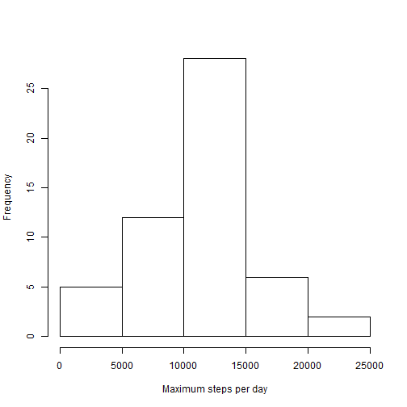
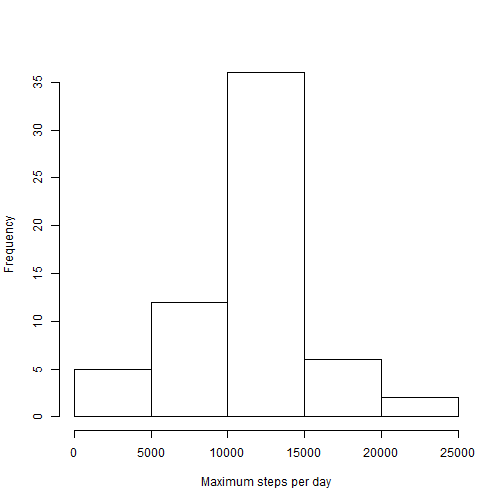

# Reproducible Research Assignment 1

## Read in the data

This section of code reads in, formats the actvity data and loads required packages.


```r
activity <- read.csv("activity.csv")
activity$date <- as.Date(activity$date)
library("dplyr")
library("lattice")
```

## What is mean total number of steps taken per day?

Histogram of the total number of steps taken each day


```r
stepsperday <- aggregate(activity$steps,by=list(activity$date),FUN=sum)
stepsperday <- rename(stepsperday,steps=x)
hist(stepsperday$steps,xlab="Maximum steps per day",main="")
```



Summary statistics for the number of steps per day are:  
+ Mean: 10766  
+ Median: 10765


## What is the average daily activity pattern?

Graph of steps by interval


```r
stepsbyint <- aggregate(activity$steps,by=list(activity$interval),FUN="mean",na.rm=TRUE)
stepsbyint <- rename(stepsbyint,interval=Group.1,steps=x)
xyplot(steps ~ interval, data = stepsbyint,type="l")
```


The 5 minute interval which on average has the most steps is 
835 


## Imputing mssing values

The number of missing values from the dataset is: 
17568 

Missing values will be set equal to the average activity for the same interval.


```r
imputted <- activity
for (i in 1:length(imputted$steps)){
    if(is.na(imputted[i,]$steps))
        {imputted[i,]$steps <- stepsbyint[stepsbyint$interval == imputted[i,]$interval,]$steps}
}
```
Histogram of the total number of steps taken each day including imputted data


```r
stepsperday <- aggregate(imputted$steps,by=list(imputted$date),FUN=sum)
stepsperday <- rename(stepsperday,steps=x)
hist(stepsperday$steps,xlab="Maximum steps per day",main="")
```



Summary statistics for the number of steps per day are:  
+ Mean: 10766  
+ Median: 10766

The mean and median number of steps per day are almost unchanged by imputting the missing values. Including the imputted data there are a higher number of days with the most frequent level of activity of 10,000 to 15,000 steps.

## Are there differences in activity patterns between weekdays and weekends?

Average activity by interval, seperated between weekdays and weekend:


```r
imputted$ww <- weekdays(imputted$date)
imputted$ww <- sub("Monday","weekday",imputted$ww)
imputted$ww <- sub("Tuesday","weekday",imputted$ww)
imputted$ww <- sub("Wednesday","weekday",imputted$ww)
imputted$ww <- sub("Thursday","weekday",imputted$ww)
imputted$ww <- sub("Friday","weekday",imputted$ww)
imputted$ww <- sub("Saturday","weekend",imputted$ww)
imputted$ww <- sub("Sunday","weekend",imputted$ww)

stepsbyintww <- aggregate(imputted$steps,by=list(imputted$interval,imputted$ww),FUN="mean",
                          na.rm=TRUE)
stepsbyintww <- rename(stepsbyintww,interval=Group.1,ww=Group.2,steps=x)
xyplot(steps ~ interval | ww, data = stepsbyintww,type="l",layout=c(1,2))
```


